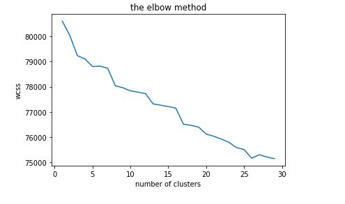
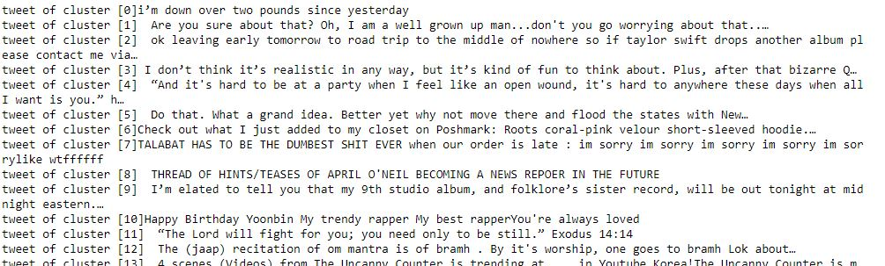

# Data-Mining-Project
# Tweets Clustering

## Goals:
-  Master Twitter API for tweets extraction
-  Master Natural Language Processing 
-  Data cleaning
-  Tweets classification 

## Requierments:

- Twitter developer account
- Twitter API

## 1- Data Extraction:
- Importing libraries ( tweepy + pandas + numpy )
- Connecting to Twitter API
- Extract tweets in multiple csv files and then combine them to one csv file

## 2- Pre-prcessing tweets:
- Search for unnecessary information using re library.
- Remove punctuation, hashtags,  profile name, URLs and emojis.
- Create a new clean csv file

## 3- Processing tweets: Natural Language Processing
- Import nltk ( Natural Language Toolkit ) which consists of the most common algorithms such as tokenizing, part-of-speech tagging, stemming, sentiment analysis, topic segmentation, and named entity recognition. NLTK helps the computer to analysis, preprocess, and understand the written text.
- Using "stopwords" to get rid of the English words which do not add much meaning to a sentence. They can safely be ignored without sacrificing the meaning.
- Using "PorterStemmer" to reduce a word to its base from whatever inflected form is encountered.

## 4- Tweets Classification: KMeans
- Import KMeans from scikit-learn
- Calculate WCSS and use the Elbow method to Find the optimal number of clusters

## Output:
- A list of 30 clusters with one tweet representing each one

          
## Conclusion:
 It is amazing what you can extract and deduct from simple words typed by ordinary people thanx to data mining and python with its vast and resourceful libraries. These information can help us make very sensitive decisions with very low risk in different fields depending on our needs.
